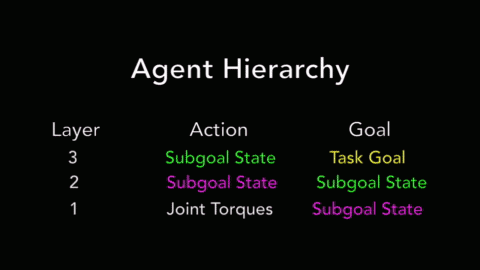
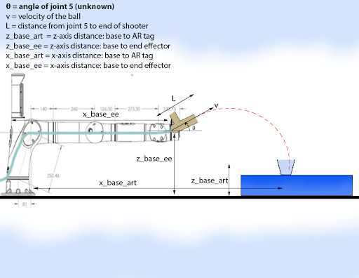
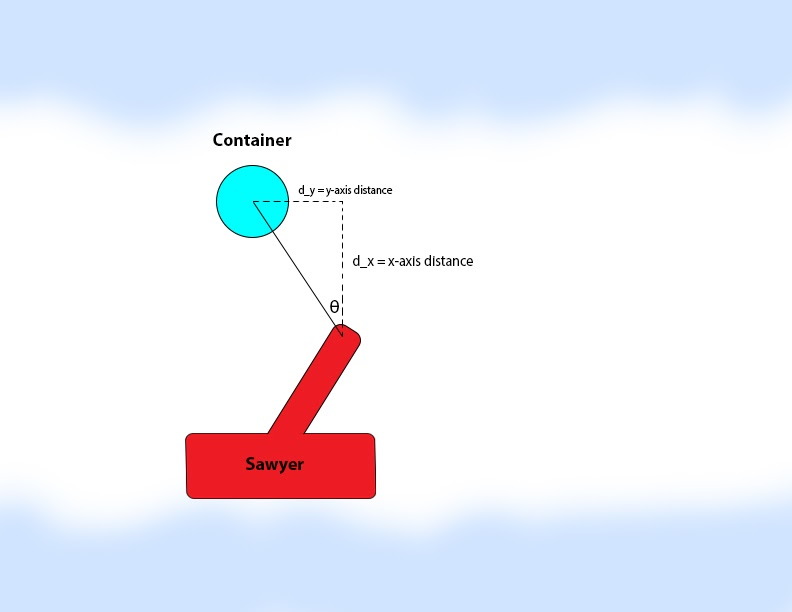
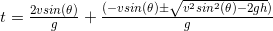
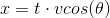

# Physics and Mathematics

## Problem

The main problem our calculations intend to address is determining the ideal joint torques to position the robot arm in the optimal position to shoot the ball into the container. 

The trajectory of the ball primarily depended on its velocity, the position relative to the cup, and the angle of the launcher. Many secondary factors such as the spin of the ball, air resistance, air currents, and forward kinematics errors also affect this trajectory.  

## Approaches

### Deep RL Approach

Our initial plan involved using a Deep RL approach using a Hierarchical Actor-Critic (HAC) as implemented by Levy et al (Paper referred to - https://openreview.net/pdf?id=ryzECoAcY7).  Our rationale for this implementation was that using a deep learning architecture would allow us to model all secondary factors without using complex equations with numerous variables that would not always be feasible. The reason for working with a HAC was that the different hierarchies of the model would be able to learn different subtasks to achieve the final goal in parallel. This would allow for faster and more precise calculations. 

We experimented with a UR5 reacher environment in Mujoco using Levy’s HAC to test the feasibility of using this approach. We tested 3, 4 and 6 layer models with various horizon, penalty and test frequency parameters. The results looked good and the arm was able to learn how to accurately move to goal positions with an average success rate of over 95%. 

  

Figure 1: Testing the UR5 reacher arm. Credit: Levy et al (https://openreview.net/pdf?id=ryzECoAcY7)

However, we realized that this simulation-based approach had two major problems. Firstly, training the model to near optimality took over 8 hours. We could not afford to have such a large bottleneck in our iteration process as we needed to constantly tune our hardware alongside our software to improve the launcher’s ability to make consistent shots. Additionally, this was only the training time for the movement stage of the model and training time would more than double once we introduced trajectory calculations and other dynamics. The second problem with this approach was that our model would be training completely in a simulation environment as training a physical robot for 8 hours while manually moving the container and loading the balls was infeasible. Once the robot was trained in Mujoco, it’s performance was not guaranteed to be the same when tested on the physical robot and we would have to constantly tune parameters and introduce thresholds.

### Newtonian Approach

As a result, we decided to physically model the primary factors using a physical model. Even though this approach would limit our potential accuracy, it was much more time-efficient to work with and improve.  

We modeled the trajectory of the ball using projectile motion equations that we derived using Newton’s laws. The next two sections will explain how we measured known values and how we derived the equations.

## Measurements

We first required 2 values to be able to rotate the base of the arm along the z-axis: the x- and y-axis distance of the container to the arm of the robot. We found these values by taking the tf_echo transforms of the base of the arm with respect to the AR tag on the container. This was used to calculate , the angle of the base joint. 

Next, we had to calculate the angle for the launcher. As shown in the figure below, we had to measure 6 variables to be able to determine ideal values for the “pitch angle” of the shooter. We will refer to this angle as  and apply it to joint 5. 

  

Figure 2: Trajectory diagram (side view)

The x- and z-axis distances were calculated using tf_echo transforms.  was calculated using the iOS measurement app and verified using a ruler. The initial velocity of the ball was calculated using a slow-motion video of the ball being shot with scale in the background for reference. We used this video to determine the distance traveled by the ball in many short time increments and averaged to get an estimated velocity. We adjusted this estimate by taking readings of the ball being shot at 45° and used the standard projectile motion equations to determine the velocity.

## Calculations

As seen in the figure below,  is calculated as . We then move the arm to an all-zero position and rotate the base joint by theta, setting it to be positive or negative based on the sign . 

  

Figure 3: Determining theta 1 (top view)

Next, we had to calculate . Our calculations are as follows: 

Let h = z_base_ee - z_base_art + L sin(θ)
Let x = x_base_art - x_base_ee - L cos(θ)

Now, when shot with velocity v, the ball spends time, t, in the air. We derived the following formula for this time using Newton’s laws: 

  

The first term, derived using the first law of motion, is the time taken by the ball to reach its peak and return to the same height from which it was shot. The second term uses an integral version of the first law of motion to calculate the time taken to reach the ground from this height. 

Our goal was to make the ball travel a distance of  m in this time. As in equation, this meant that we needed a value for  that solved the following equation: 

  

By substituting in our known values and grinding out the algebra we arrived at the following equation: (Note: although the equation uses  in the second term on the RHS, our code computed the positive value of this term since our ball was moving down, in the negative z-axis. The same applies to gravity and z-axis distance terms).

Solving this equation using Scipy’s fsolve with an initial value of  gave us at most two solutions for theta. We picked the acute angle closest to 45° for our chosen value. 

Finally, we applied  and  to the base joint and joint 5 respectively.

Another small calculation that we implemented dealt with AR tag identification instability. The AR tag would often bounce around in Rviz, causing us to aim and shoot in the wrong direction. To fix this, we took 10 readings of our lookupTransform from the arm to the AR tag and took the median value to get rid of the noisy data. Initially, 10 readings were not enough to shield us from the noise, however, reducing the sampling rate of our loop fixed the problem as the AR tag spent more time in the correct location than the incorrect one. 

## Future Improvements

While our shooter did work correctly, we recognize that we can do even better and shoot the ball into even smaller containers consistently. Here are some ideas that we have for future work:

1. Incorporate RL and compare deep learning-based models to the physics-based models. Extend this to testing for the point at which one becomes better than the other. 
2. Incorporating air resistance and other factors in our physics equations. 
3. Converting solutions for theta that aren’t in the first coordinate to acute angle solutions for .
4. Choosing a theta value returned by fsolve after taking into account the uncertainty of the solution.  
5. Further developing our equations to be able to shoot from multiple positions in the arms reachable workspace. Initially, this would involve shooting from any point in a circle formed by a fully extended arm after applying  in the YZ-plane. Next, we would remove the circle constraints. Finally, we should be able to shoot from any place in the workspace that has a feasible solution. 
6. Identifying obstacles and calculating whether there is a feasible shot that can avoid the obstacle. This can be extended to bouncing the ball around the obstacle, however, this would be a very complex project which would require some sophisticated learning methods/modeling. Attempting to this using a modified version of our Newtonian approach would provide better insight into how difficult the problem actually is. 

### [Return to Design](design.md)
