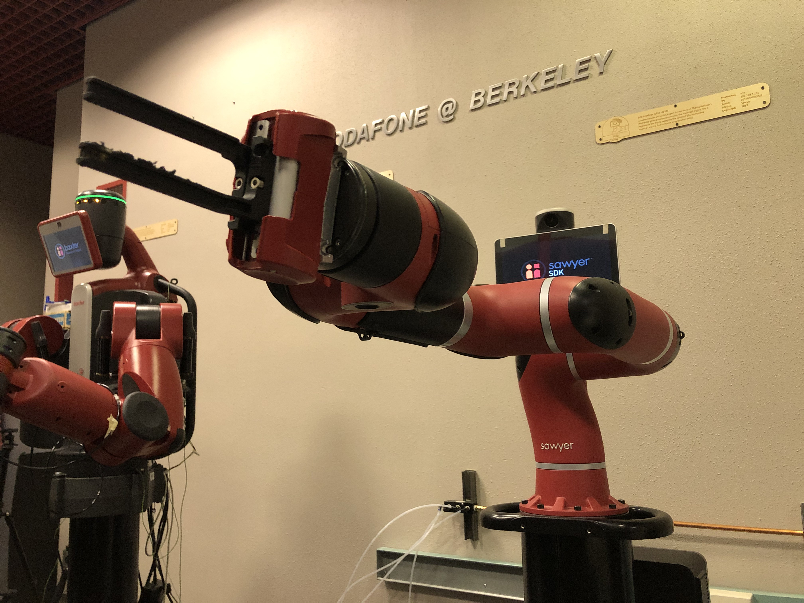
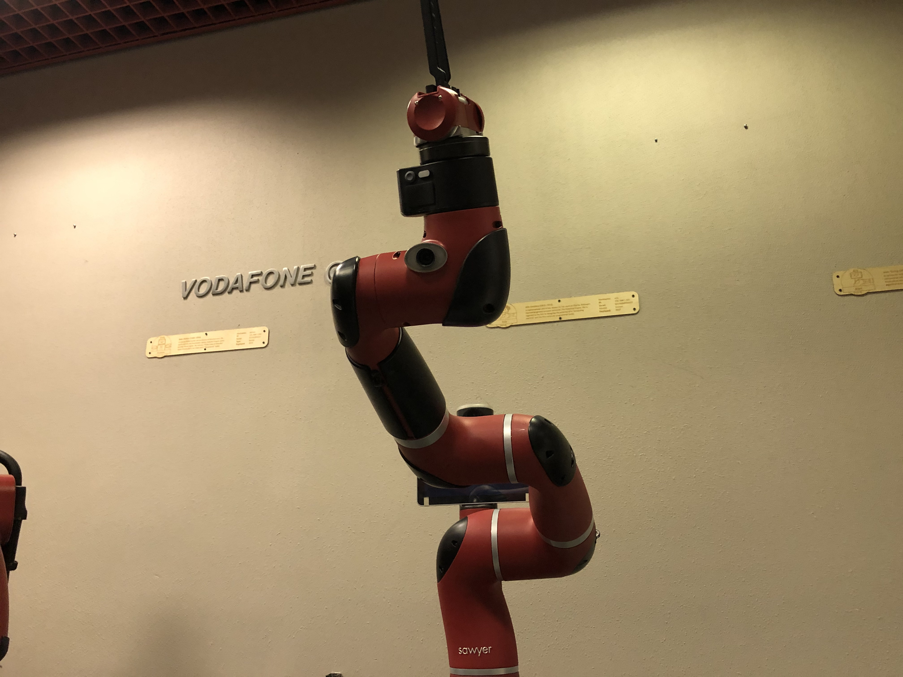
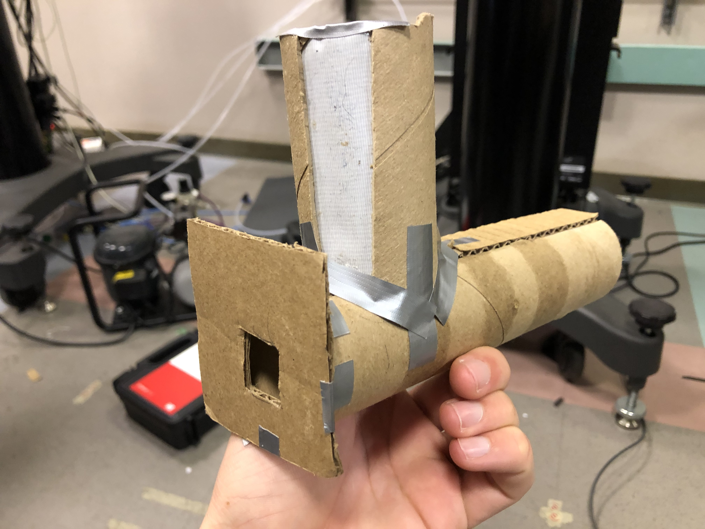

# Results

## Efficiency

Our robot overall was very effective in being able to scan for and locate the AR tag as well as aim at the target container following AR tag location. However, in regards to the calculation and angling of the tool joint angle, the device was sometimes inconsistent with the ideal joint angle when the target container was placed below the z-coordinate of the base frame of the robot.

## Photos

Image 1: The robot in the zero configuration.

Image 2: The robot in the scanning configuration.

Image 3: The design of the ping pong ball launcher.

Image 4: The AR tag used for sensing.

## Video

To see our project in action, click on [this link](https://youtu.be/TibLswGP-6U).

### [Return to home](index.md)
