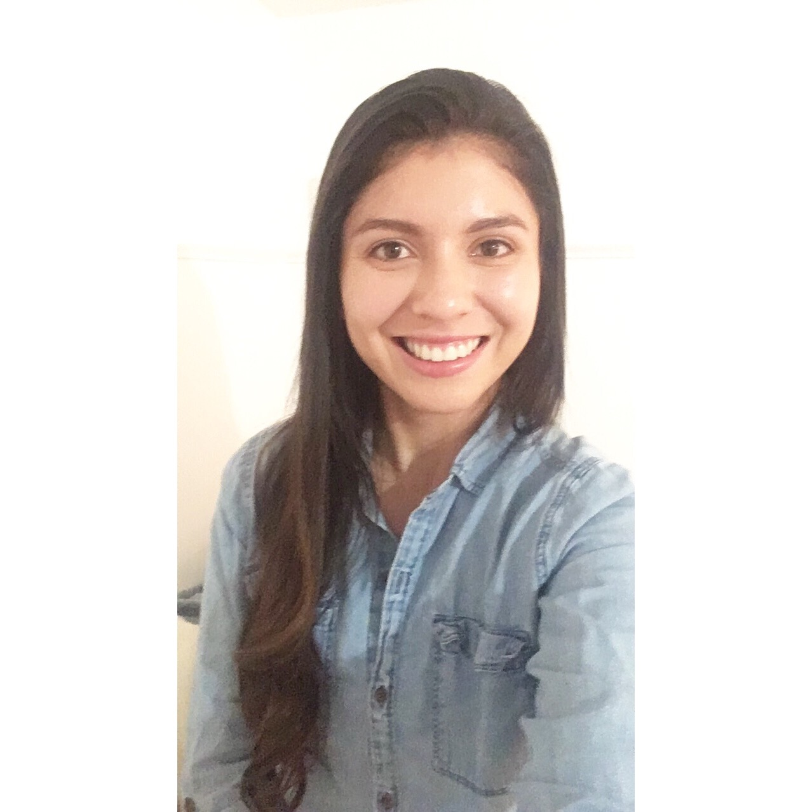

# Meet the Team!

## Yash Agarwhal

## Jacob Fisher

Jacob primarily focused on the design aspects of the project and the administrative aspects of the project, including making the presentation and website as well as  communicating with course staff regarding hardware and mechanical components.

## Varun Jhunjhunwalla

Varun primarily worked on testing the Deep RL approach and modeling the physics and other equations. He also helped with building the launcher and implementing the equations in Python.

## Robert Jiang

## Stephanie Ortiz-Sevilla

Stephanie contributed primarily in program execution and integration. This included anything from writing and debugging code to troubleshooting Sawyer when our team couldn't get it to do what we wanted. 

### [Return to home](index.md)
